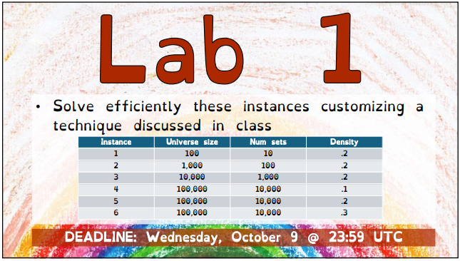

## Lab 1 of the Computational Intelligence Course at PoliTO

*All rights of the image goes to Giovanni Squillero*

## Choices rationale
- **Tweak:** the simple **tweak** is used since it has been proven to be the most effective compared to **probabilistic tweak** and **multiple_mutation_tweak**
- **Restart:** a **restart** mechanism is used since it has been proven to be the most effective compared to no **restart**, although the number of **restarts** is quite low w.r.t. the number of iterations. The restart mechanism is triggered when the new solution has a degradation ratio of more than a certain threshold compared to the best solution found so far. The threshold has been chosen through a process of trial and error as well.
- **Simulated Annealing:** the simulated annealing **hyper-parameters** have been chosen through a process of trial and error. Just like **restart**, the number of **annealings** is quite low w.r.t. the number of iterations, however it has been proven to increase the performance of the system.
  
A more optimal way to choose these hyperparameters would have been to use a grid-search mechanism, however, due to time and computational power constraints, I had to resort to a trial and error approach.

## Performance
| Instance | Universe size | Num sets | Density | Number of steps | Cost solution       |
| -------- | ------------- | -------- | ------- | --------------- | ------------------- |
| 1        | 100           | 10       | 0.2     | 10.000          | -267.01783917689494 |
| 2        | 1.000         | 100      | 0.2     | 10.000          | -6455.151486505789  |
| 3        | 10.000        | 1.000    | 0.2     | 10.000          | -123945.00229156965 |
| 4        | 100.000       | 10.000   | 0.1     | 1.000*          | -113026161.51668444 |
| 5        | 100.000       | 10.000   | 0.2     | 1.000*          | -241328816.28203663 |
| 6        | 100.000       | 10.000   | 0.3     | 1.000*          | -384628328.6190319  |

All provided solutions are valid.

*The number of steps has been decreased to 1.000 since I wouldn't have made it in time for the deadline otherwise.

## Contributors
Some techniques implemented in my proposal were discussed and developed jointly with my [colleague]( https://github.com/FerraiuoloP/).
We started from the same template, then we discussed how simulated annealing would work in our scenario and we sort of implemented it together(although our versions differ).

